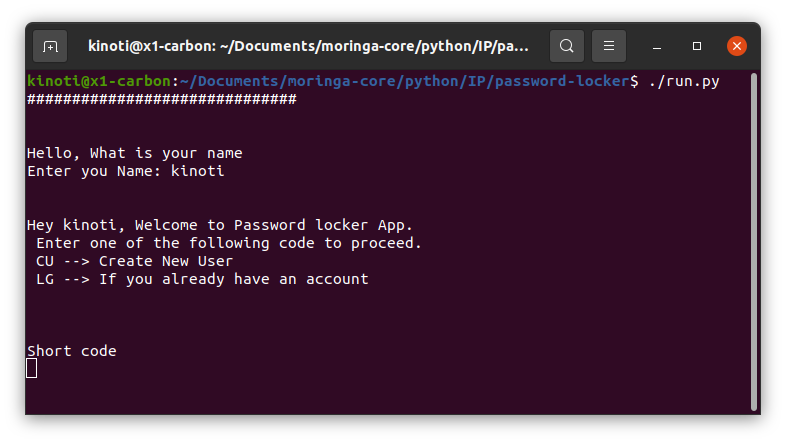
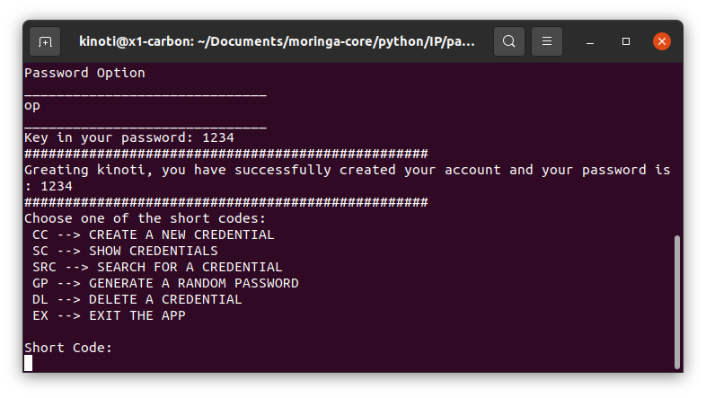
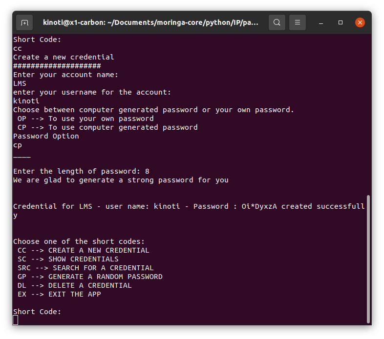
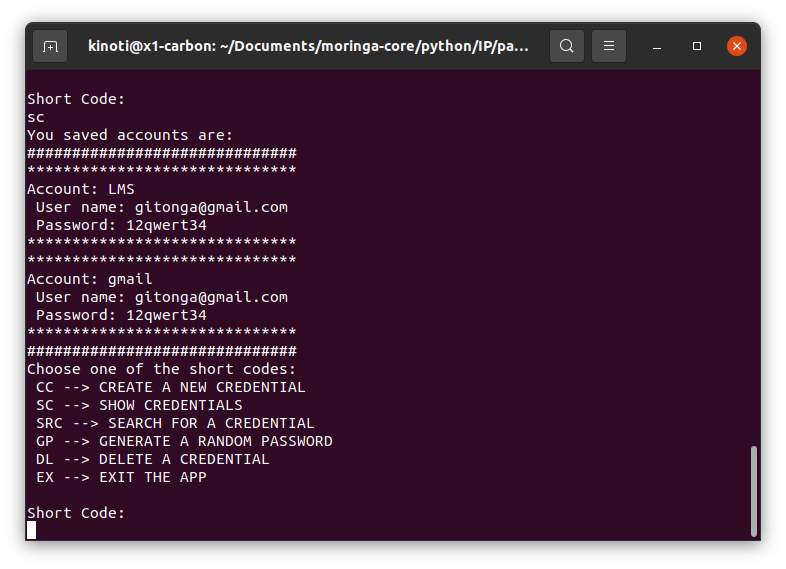
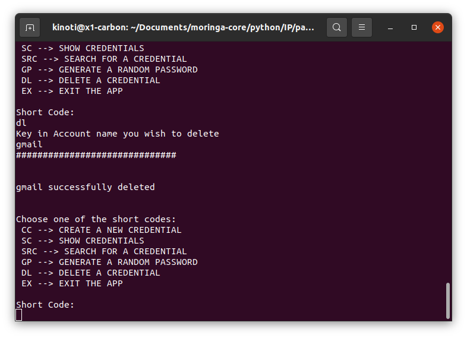
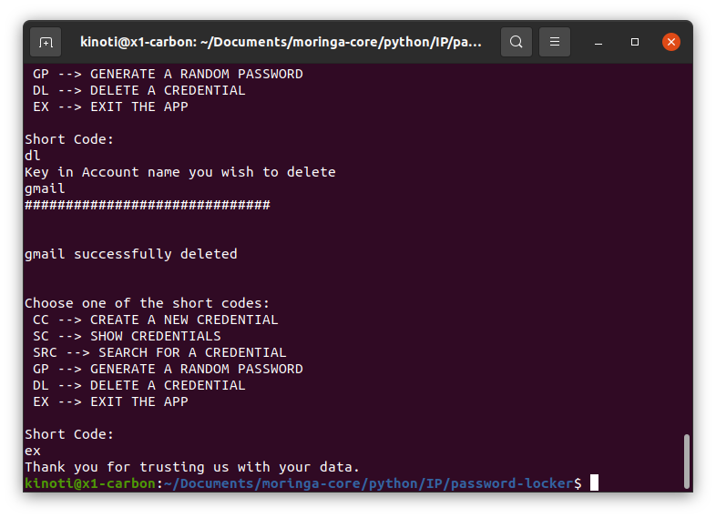

# Password Locker

## Developed by

[Kinoti Gitonga](https://github.com/ikinoti)

## Project Description

This is a password locker application made of python. The application manages user credentials for various platforms and helps them create new platform as it assist them generate random passowrd if they wish.

## Screenshot Demos













## Setup/Installation

#### Requirement for the application to run

- python3.8
- pyperclip
- pip

#### cloning

- Open your terminal

- git clone https://github.com/ikinoti/password-locker.git

* cd password-locker

* open in your prefered text editor

### To learn the application

- Open the cloned folder in the terminal and run the following commands:

```
    $ chmod +x run.py
    $ ./run.py
```

## Behaviour Driven Development

We want our application to:

1. allow user to create new credentials.
2. save credentials.
3. display credentials.
4. delete credentials.
5. Display credentials information.

## Technologies used

- python3.8

## Know Bugs

- the login function is not functioning as per needed.

## Contact information

For any question or contribution, reach me via [isaiah.gitonga@student.moringaschool.com]

## License

- _MIT License_
- copyright (c) 2021 **iKinoti**
